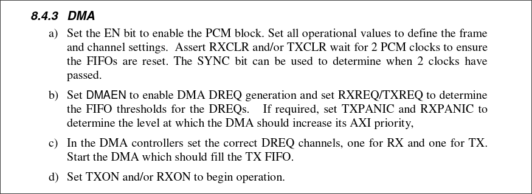

# Documentation

Sommaire:


### Organistion du projet :

- **boot**      -> dossier à copier sur la carte SD pour booter sur la raspberry pi 3B
- **src**       -> dossier contenant les fichiers sources du projet
- **include**   -> dossier contenant les headers du projet
- **Makefile**  -> permet de compiler avec les fichiers présents dans src et include et génère l'image kernel à copier dans la carte SD

## Matériel

### Kernel

---

### Activation de la FPU

Pour pouvoir utiliser des valeurs flottantes et double il faut activer la *FPU* présente sur le CPU (cortex A53) de la raspberry pi.

Dans le fichier boot.S après le eret qui permet de passer en privilège EL1 lorsque le code entre dans *EL1_entry* les lignes suivantes ont été rajoutées : 

```asm
mov x0, #3
lsl x0, x0, #20
msr CPACR_EL1, x0
```
Ces lignes permettent de de mettre la valeur (0b11 << 20) dans le registre système `CPACR_EL1` pour activer la FPU et le SIMD.

---

### Fonctionnement du PCM

Le PCM est un module présent dans la raspberry pi pour communiquer via le protocole I²S.

Le code en rapport avec l'initialisation et l'utilisation de ce module est présent dans les fichiers *i2s.c* et *i2s.h*.

Pour initialiser le PCM, il faut suivre plusieurs étapes dans un ordre précis afin de s'assurer de la bonne initialisation.

1. Initialiser les broches GPIO concernant le PCM
2. Choisir la bonne horloge et choisir la bonne fréquence
3. Activer le PCM
4. Paramétrer les registres matérielles du PCM
5. Vider la FIFO TX et attendre 2 cycle de la clock d'entrée du PCM
6. Activer et paramétrer l'envoie de signaux vers la DMA

Ensuite il faut paramétrer et activer la DMA et ensuite nous pouvons activer la transmissions des données stockées dans la FIFO TX vers les broches.

---

```c
static void pcm_init_gpio()
{
    unsigned int FSEL1 = *(volatile unsigned*)GPFSEL1; //GPIO 18 - 19
    unsigned int FSEL2 = *(volatile unsigned*)GPFSEL2; //GPIO 20 - 21

    FSEL1 &= ~(((0b111) << 24) | ((0b111) << 27));
    FSEL2 &= ~((0b111) | ((0b111) << 3));

    FSEL1 |= ((0b100 << 24) | (0b100 << 27));
    FSEL2 |= ((0b100) | (0b100 << 3));

    *(volatile unsigned*)GPFSEL1 = FSEL1;
    *(volatile unsigned*)GPFSEL2 = FSEL2;
    
    *(volatile unsigned*)GPPUD = 0;
    delay(150);
    *(volatile unsigned*)GPPUDCLK0 = (1 << 18 | 1 << 19 | 1 << 20 | 1 << 21);
    delay(150);
    *(volatile unsigned*)GPPUDCLK0 = 0;
}
```

La fonction `pcm_init_gpio()` permet d'initialiser les broches 18, 19, 20, 21 en mode ALT0 associé à la valeur 4.

```c
FSEL1 &= ~(((0b111) << 24) | ((0b111) << 27));
FSEL2 &= ~((0b111) | ((0b111) << 3));

FSEL1 |= ((0b100 << 24) | (0b100 << 27));
FSEL2 |= ((0b100) | (0b100 << 3));
```
Cette partie permet de masquer l'ancienne valeur en mettant que des 0 dans les parties de GPFSEL1 et GPFSEL2 pour y écrire la nouvelle valeur dans les bits associés aux broches.

Par la suite nous précisons que nous n'utilisons aucune résistance de pull-up ou pull-down interne à la raspberry pi en écrivant 0 dans le registre GPPUD.

Nous devons attendre 150 cycles CPU pour prendre en compte la modification avant d'écrire dans le registre GPPUDCLK0 pour préciser sur quelles broches nous voulons ces modifications.

---

Maintenant que les broches sont bien paramétrées, nous allons passer à la gestion des clocks.

```c
static void pcm_init_clock() {
    *(volatile unsigned*)CM_PCMCTL = (CM_PASSWORD | (*(volatile unsigned*)CM_PCMCTL & (~ 0x10)));  //disable clock

    while(*(volatile unsigned*)CM_PCMCTL & (1 << BUSY));    //wait the clock is not busy

    *(volatile unsigned*)CM_PCMDIV = (CM_PASSWORD | (0x162 << 12) | 0x4EF); //set the divider

    *(volatile unsigned*)CM_PCMCTL = (CM_PASSWORD) | (0b01 << 9) | 0x10 | 0b0110; //set the clock with 1 division, PLLD used and enable
}
```
Cette fonction permet de paramétrer la clock utilisée par le module PCM via le registre CM_PCMCTL.

L'écriture dans chacun des registres en rapport avec les clocks nécessite de mettre une valeur dans les 8bits de poids forts appelé **CM_PASSWORD** qui est une sécurité matérielle pour prendre en compte chaque modification. Sans ce CM_PASSWORD, aucune modification ne sera prise en compte à chaque écriture.

Dans un premier temps, il faut désactiver la clock du PCM sur le bit 1.

Il faut attendre que tout soit bien désactivé en attendant que le bit associé à BUSY nous informe que le changement s'est bien établi via la boucle while.

Maintenant dans le registre CM_PCMDIV, nous allons ajouter la valeur associée à la fréquence de la BCLK. 

En sachant que nous utilisons une fréquence d'échantillonage de 44100Hz avec 2 canaux et avec des valeurs de 16bits, notre BLCK doit être de : 44100 * 2 * 16 = 1411200 Hz.

Nous allons choisir la **clock PLLD** d'une fréquence de 500MHz pour une meilleure précision donc :

`500 000 000 / 1 411 200 = 354.30839`

Nous devons donc mettre la valeur 354 dans les 12 bits de poids forts et pour gérer la partie décimale pour gagner le plus de précision qui sont sur 12bits :  0.30839 * 2^12 = 1263
donc nous devons mettre la valeur 1263 sur les 12 bits de poids faibles.

Après toutes ces étapes, nous pouvons mettre dans PCMCTL la clock PLLD comme clock source, choisir d'avoir une division pour gérer la partie décimale et activer la clock de destination pour le module PCM.

---

Paramétrer le registre matérielle **MODE_A**.

Ce registre permet de choisir le fonctionnement des différentes clocks.

```c
static void pcm_init_modea()
{
    unsigned mode_a = 0;
    mode_a &= (~(1 << 28));   //enable PCM clock 
    mode_a |= (1 << 24);    //split fifo word into 2 words of 16bits
    mode_a &= (~(1 << 23));   //master mode PCM CLK to output
    mode_a &= (~(1 << 21));   //master mode FS CLK to ouput
    mode_a &= (~(1 << 20));    //FS is high first then low
    mode_a |= (31 << 10);   //nbr PCM clock master for 1 word
    mode_a |= (16);         //nbr PCM clock for FS word
    
    *(volatile unsigned*)PCM_MODE_A = mode_a;
}
```

Cette fonction permet d'activer les clocks vers le module PCM et d'informer si c'est clock sont master ou slave (dans notre cas master car elle va diriger le DAC externe). Le nombre de cycles correspondant à la BLCK pour envoyer une donnée et le nombre de cycles de la fréquence d'échantillonage pour une valeur numérique à envoyer sur chaque canal.

Il faut préciser 31 pour le nombre de cycle de BCLK pour envoyer 32 bits afin de passer au prochain mot présent dans file du PCM.
Comme une valeur envoyée sur un canal est sur 16 bits il faut préciser à la fréquence d'échantillonage qu'il faut 16 cycles par canal.

Nous utilisons des mots de 32 bits pour stocker la même valeur 16 bits à envoyer sur les deux canaux et nous précisons que le mot doit être coupé en deux pour faire la distinction. Les 16 bits de poids forts iront dans un canal et les 16 bits de poids faibles iront dans l'autre canal.

Nous précisons que la fréquence d'échantillonage doit récupérer un prochain échantillon sur chaque front montant et change de canal à chaque changement d'état de la clock.

---

Paramétrer le registre matérielle **TXC_A**

Ce registre permet d'initialiser la transmission des données sur les différents canaux.

```c
static void pcm_init_tx() {
    unsigned tx_a = 0;

    tx_a |= (1 << 30);  //enable chanel 1
    tx_a |= (8 << 16);   //width of 16bits for chanel 1
    tx_a |= (0 << 20);  //position 0

    tx_a |= (1 << 14); //enable chanel 2
    tx_a |= (8);   //width of 16bits for chanel 2
    tx_a |= (16 << 4);  //position of the value to chanel 2 to send

    *(volatile unsigned*)PCM_TXC_A = tx_a;
}
```

Cette fonction permet d'activer les deux canaux et la taille des mots à transmettre par canal et la position dans le mot de 32 bits.

---

Initialiser le module PCM à 100% : 

```c
void pcm_init(){
    pcm_init_clock();
    pcm_init_gpio();
    

    *(volatile unsigned*)PCM_CS_A = 1;  //EN PCM interface
    *(volatile unsigned*)PCM_CS_A |= (1 << 25); //disable StAndyBy ram

    pcm_init_tx();
    pcm_init_modea();

    *(volatile unsigned*)PCM_CS_A |= (1 << 3); //Assert to clear TX FIFO
    *(volatile unsigned*)PCM_CS_A |= (1 << 24);
    while(!(*(volatile unsigned*)PCM_CS_A & (1 << 24))); //wait 2 PCM clock

    *(volatile unsigned*)PCM_DREQ_A = (32 << 8); //half of the PCM FIFO request DMA to send data

    *(volatile unsigned*)PCM_CS_A |= (1 << 9); //enable DMA REQ
}
```

Cette fonction permet d'initialiser tous les registres en suivant les étapes décrites dans la documentation du BCM2837.



Donc dans un premier temps, on initialise la clock, les broches du PCM.

`*(volatile unsigned*)PCM_CS_A = 1;  //EN PCM interface`

Cette ligne permet d'activer le module PCM (correspondant à l'étape a).

`*(volatile unsigned*)PCM_CS_A |= (1 << 25); //disable StAndyBy ram`

Cette ligne permet d'activer la section de RAM du PCM.

```c
*(volatile unsigned*)PCM_CS_A |= (1 << 3); //Assert to clear TX FIFO
*(volatile unsigned*)PCM_CS_A |= (1 << 24);
while(!(*(volatile unsigned*)PCM_CS_A & (1 << 24))); //wait 2 PCM clock
```

Cette partie permet de vider la FIFO TX et d'attendre 2 cycles d'horloge pour s'assurer que la file soit bien vide.
Pour s'assurer que 2 cycles soient passés, il faut mettre le bit 1 et lorsqu'il revient à 1, les cycles se sont écoulés.

```c
*(volatile unsigned*)PCM_DREQ_A = (32 << 8); //half of the PCM FIFO request DMA to send data
*(volatile unsigned*)PCM_CS_A |= (1 << 9); //enable DMA REQ
```


Cette partie permet d'activer les requêtes vers la DMA pour l'informer qu'il faut remplir la FIFO TX via le bit 9 du registre CS (Control and Status) et de préciser à partir de combien d'éléments présents dans la FILE il faut envoyer les requêtes.

En sachant que la FIFO TX fait une taille de 64 éléments il faut ne pas écrire une valeur plus grande que 64 sinon le PCM enverrai un signal tout le temps.

---
```c
void pcm_start_transmission() {
    *(volatile unsigned*)PCM_CS_A |= (1 << 2);  //enable transmission
}
```

Cette fonction permet d'activer la transmission des données.

Cette fonction s'appelle après l'initialisation de la DMA.

---

### Fonctionnement de la DMA

La DMA permet d'envoyer des données stockées en mémoire vers des composants périphériques sans que le CPU se charge de les transmettre. ça permet ainsi d'éviter de surcharger le CPU.


La DMA de la raspberry pi est composée de plusieurs canal permettant de gérer plusieurs communication entre plusieurs périphériques. Chaque canal est composé de 3 registres hardwares :
 
- CS -> Control and Status
- CONBLK_AD -> L'adresse de la structure Control Block
- DEBUG -> Des informations pour débugger

est les autres sont également des registres mais gérés par une structure appelée **Control Block**.

```
struct Control_Block {
    unsigned TI;                //transfer information
    unsigned SOURCE_AD;         //source address
    unsigned DEST_AD;           //destination address
    unsigned TXFR_LEN;          //transfer length
    unsigned STRIDE;            //2D mode stride
    unsigned NEXTCONBK;         //Next control block address
    unsigned PADDING[2];        //useless but needed
}__attribute__( (aligned(32)) );
```

Voici la structure qui doit être alignée sur 256 bits avec un padding de 64 bits.

Un block de contrôle stocke l'adresse source des données à récupérer, l'adresse de destination qui doit recevoir les données, le nombre de données à envoyer et l'adresse du block de contrôle prochain qui prendra le relai lorsque l'actuel aura terminé d'envoyer toutes les données.

La DMA possède également un registre **ENABLE Register** qui permet d'activer les canaux qui doivent être utilisés.

Les données qui doivent être envoyés par la DMA sont stockées dans un tableau de 2048 éléments et la DMA parcourira l'ensemble du tableau pour envoyer chaque élément vers le PCM.

Pour éviter d'écrire les données au même endroit que la DMA envoie les valeurs, nous utilisons 2 blocks de contrôle qui se partagent le tableau en 2 (un pointant vers l'indice 0 et l'autre vers 1024) et dès qu'un block à fini de parcourir sa moitié, il envoie une interruption et amène l'autre block dans le canal pour traiter l'autre partie du tableau.

Ainsi nous écrivons dans la partie qui n'est pas traité par la DMA.

Le fait d'avoir 2 blocks de contrôle permet de gérer un buffer de manière circulaire.

La gestion de la DMA de la raspberry pi se trouve dans les fichiers *dma.c* et *dma.h*.

---


```c
void dma_init_controlBlock() {
    DMA_BLOCK_1.TI = (2 << 16) | (1 << 8) | (1 << 6) | (1 << 3) | 1; //set PERMAP TO PCM TX | increment source addrr after read | wait PCM to send data to write
    DMA_BLOCK_1.SOURCE_AD = (unsigned)((unsigned long)(&dma_buffer[0]) | 0xC0000000);
    DMA_BLOCK_1.DEST_AD = (unsigned)PCM_FIFO_TX_BUS;
    DMA_BLOCK_1.TXFR_LEN = DMA_BUFFER_SIZE_HALF * 4;
    DMA_BLOCK_1.STRIDE = 0;
    DMA_BLOCK_1.NEXTCONBK = (unsigned)((unsigned long)(&DMA_BLOCK_2) | 0xC0000000);

    DMA_BLOCK_2.TI = (2 << 16) | (1 << 8) | (1 << 6) | (1 << 3) | 1; //set PERMAP TO PCM TX | increment source addrr after read
    DMA_BLOCK_2.SOURCE_AD = (unsigned)((unsigned long)(&dma_buffer[DMA_BUFFER_SIZE_HALF]) | 0xC0000000);
    DMA_BLOCK_2.DEST_AD =  (unsigned)PCM_FIFO_TX_BUS;
    DMA_BLOCK_2.TXFR_LEN = DMA_BUFFER_SIZE_HALF * 4;
    DMA_BLOCK_2.STRIDE = 0;
    DMA_BLOCK_2.NEXTCONBK = (unsigned)((unsigned long)(&DMA_BLOCK_1) | 0xC0000000);
}
```

Cette fonction va initialiser les 2 blocks de contrôle que nous utilisons pour accéder au tableau, rediriger vers la FIFO TX du PCM. La taille correspond à la moitié du tableau dans *TXFR_LEN*. le *\*4* indique le nombre de d'octet au total à envoyer.

La partie *STRIDE* permet de gérer des valeurs organisées sur des tableaux à 2 dimensions, dans notre cas, ce n'est pas nécessaire.

Le registre *TI* permet de gérer les informations de transmission de la DMA vers la destination.
La DMA attend le signal du PCM pour envoyer les données, et va parcourir le tableau en incrémentant la source.


## Traitement du signal