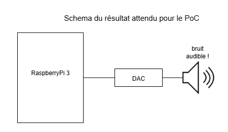

<table width=100%>
  <tr>
    <td align="left">
        
        
    </td>
    <td align="right">
        
    </td>
  </tr>
</table>

 
 
 
 
 

<h1 align="center">Projet Synthèse Sonore   Cahier des charges</h1>

2025–2026

 

Groupe BotWave :  Arthur ARNOLD, Paul CLUZEL, Tinhinane AIT-MESSAOUD, Noémie GIREAUD

 
 
 
 
 

<table width=100%>
  <tr>
    <td align="left">
        Superviseur :    Mr Emmanuel RIO 
    </td>
    <td align="right">
        Version 1 :  12/10/2025
    </td>
  </tr>
</table>

# Sommaire

<!-- TOC -->

- [Sommaire](#sommaire)
- [1 - Exposé introductif](#1---exposé-introductif)
  - [Contexte](#contexte)
  - [Objectifs](#objectifs)
- [2 - Analyse de l'existant et des risques :](#2---analyse-de-lexistant-et-des-risques-)
  - [Contraintes organisationnelles :](#contraintes-organisationnelles-)
  - [Contraintes techniques :](#contraintes-techniques-)
  - [Contraintes humaines :](#contraintes-humaines-)
  - [Contraintes financières :](#contraintes-financières-)
- [3 - Analyse des nouveaux besoins](#3---analyse-des-nouveaux-besoins)
  - [Besoins fonctionnels](#besoins-fonctionnels)
  - [Besoins non-fonctionnels](#besoins-non-fonctionnels)
- [4 - Description de la solution](#4---description-de-la-solution)
  - [Cas d'utilisation](#cas-dutilisation)
    - [Cas nominaux :](#cas-nominaux-)
    - [Cas particuliers :](#cas-particuliers-)
  - [Maquette](#maquette)
  - [Nouveaux besoins](#nouveaux-besoins)
  - [Identification des risques](#identification-des-risques)
  - [Matériels mis en œuvre](#matériels-mis-en-œuvre)
  - [Contraintes additionnelles](#contraintes-additionnelles)
  - [Modalités de déploiement](#modalités-de-déploiement)
    - [Installation](#installation)
    - [Formation](#formation)
    - [Documentation](#documentation)
- [5 - Modalités d'organisation](#5---modalités-dorganisation)
  - [Rôles des intervenants](#rôles-des-intervenants)
  - [Découpage en tâche, assignation, programmation (Gantt)](#découpage-en-tâche-assignation-programmation-gantt)
  - [Communication avec le client/superviseur](#communication-avec-le-clientsuperviseur)
  - [Communication et collaboration au sein du groupe](#communication-et-collaboration-au-sein-du-groupe)
  - [Procédure de gestion des risques](#procédure-de-gestion-des-risques)

<!-- /TOC -->
 
 
 
 
 

# 1 - Exposé introductif

## Contexte

Le projet Synthèse Sonore s’inscrit dans le cadre du projet long de Master 2 SECIL durant l’année 2025/2026.
Il s’agit de concevoir et réaliser un synthétiseur sonore numérique sur une carte embarquée.

Ce projet combine des aspects techniques comme la programmation bare-metal, la gestion d’interfaces matérielles mais aussi un aspect créatif avec différentes sorties sonores, un enrichissement de l’interface permettant de proposer un synthétiseur plus complet et de choisir une qualité de rendu sonore.

Le développement se fera en bare-metal sur une carte Raspberry PI sans aucune librairie externe. Initialement avec la librairie Circle permettant de simplifier le code bare-metal de l’environnement grâce à l’accès direct aux périphériques mais après les *proofs of concept* nous avons rencontré des problèmes avec son utilisation.
Les échantillonages du signal sonore seront transmis via le protocole Inter-IC Sound ($I^{2}S$) vers un convertisseur numérique analogique (Digital Analog Converter) qui va ensuite les convertir en signal analogique au niveau ligne.

Ce cadre permet de rencontrer les problématiques du domaine des systèmes embarqués avec les contraintes de temps réel, de la gestion des périphériques.

Pour ce qui est de l'interface utilisateur, le choix était libre tant que une action de l'utilisateur menait à la synthèse du son avec faible latence. Ainsi, pour la réalisation de ce projet, nous avons décidé d'implémenter une interface utilisateur semblable à un piano ou synthétiseur. Des touches de claviers représenteront les différentes notes, et d'autres touches supplémentaires pouront être utilisées pour la configuration du son rendu.  

## Objectifs

L’objectif de ce projet est de concevoir un système complet de synthèse sonore embarqué allant de la génération d'un signal audio jusqu'à son contrôle via une interface physique.

Le résultat attendu comprend :
- La génération d’un son prédéfini
- Une latence très faible (< 10ms) entre le déclanchement et la production du son

Le projet doit également démontrer la maîtrise de la programmation bare metal sur Raspberry Pi, une gestion d’interface matérielles (GPIO, I²S, DAC), la mise en oeuvre d’algorithmes de synthèses sonores ainsi qu’une documentation complête expliquant le fonctionnement du synthétiseur.

# 2 - Analyse de l'existant et des risques : 

## Contraintes organisationnelles : 

La version finale du cahier des charges ci-présent doit être remise début décembre. Pour garantir l’optimalité de celui-ci, des rendus intermédiaires bi-mensuels seront livrés aux encadrants du projet.
La partie technique du projet doit être achevée avant la fin du second semestre.

Le temps de travail doit être articulé autour du créneau alloué à cet effet, du temps libre des étudiants ainsi que de celui de l’encadrant.   

Pour continer, nous devons suivres plusieurs methodes organisationnelles dont une différenciation des rôles de tous les membres de l'équipe, une répartition équitable des tâches ainsi qu'un diagramme de Gantt afin de visualiser l'avancement des tâches dans le temps.

Finalement, des réunions régulière doivent être organisées entre le groupe et son superviseur. L'interval de temps entre les réunions peut varier en fonction de l'avancée dans le travail, mais un contacte doit être établit au moins 1 fois par mois.

## Contraintes techniques :

Le matériel utilisé lors du projet n’ayant pas été étudié auparavant par l’ensemble des membres, une mise à niveau peut s'imposer afin que tous puissent le manipuler correctement. Si la mise à niveau trop complexe, cela pourait ainsi retarder l’avancée du projet.  

La définition et le test d’un *Proof of Concept* (POC) en amont du projet est nécessaire afin d’éviter toute mauvaise surprise quant à l’interopérabilité des composants choisis et le fonctionnement de la solution.  

L’architecture du système devra être modulaire et extensible, permettant l’intégration de nouveaux modules ou fonctionnalités destinées à l’implémentation d’instruments de musique supplémentaires.  

Le projet étant amené à être repris par l’encadrant ou par d’autres étudiants, une documentation technique claire et précise doit être rédigée tout au long du développement.

## Contraintes humaines : 

Le projet s’articulant autour d’un matériel physique, l’ensemble de l’équipe à besoin d’être présent physiquement pour effectuer les différents tests. Cela risque d'empêcher le travail à distance si un partage des ressource n'est pas organisé au préalable.

La réussite du projet repose sur la collaboration et l’investissement de l’ensemble des membres de l’équipe. Les différences de niveau technique, disponibilité et motivation peuvent représenter un frein à la bonne avancée du projet.
- L’absence ou incapacité de travail d’un membre du groupe est un risque toujours présent, auquel cas, les autres membres devraient pouvoir prendre le relais et repenser la répartition.

Une répartition claire et équilibrée des tâches ainsi qu’une communication régulière sont essentielles pour garantir une progression harmonieuse et un projet réussi.

## Contraintes financières : 

Le budget initial du projet doit être inférieur à la valeur transmise par l’enseignant responsable.

Le projet s’articule autour d’un microcontrôleur dont le prix peut être élevé et le remplacement lent voire inaccessible. Une attention particulière devra être portée à la manipulation des équipements afin d’éviter toute dégradation matérielle susceptible d’engendrer des dépenses supplémentaires ou des retards. Une solution de secours serait d'emprunter le matériel disponible dans la salle d’étude U3-305.

# 3 - Analyse des nouveaux besoins

## Besoins fonctionnels
[TODO]
## Besoins non-fonctionnels
[TODO]

# 4 - Description de la solution

## Cas d'utilisation

### Cas nominaux :
- UC1 : *(Synthèse monophonique)* L’utilisateur appuie sur une touche (clavier d’un octave seulement) associé à une certaine note de musique. Cette note sera audible via une sortie jack dès l'appuie sur la touche.
  - UC1bis : *(Synthèse polyphonique)* possibilité de superposer différentes notes quand on appuie sur plusieurs boutons en même temps.
- UC2 : au relâchement de la touche par l’utilisateur, arrêt ou décroissance de l’amplitude du signal jusqu'à que le son devienne inaudible.
- UC3 : l’utilisateur à la possibilité d'appuyer sur deux touches supplémentaires : un bouton permettra d'augmenter l'octave de la note, tandis que l'autre la diminue.
- UC4 : l’utilisateur peut utiliser un potentiomètre (ou autre entrée analogique) pour régler le volume sonore de sortie.

### Cas particuliers :
- UC5 : l’utilisateur peut appuyer sur un bouton specifique pour changer le mode des son ressortis : un premier mode permet d'entendre des notes de musiques (DO, Ré, Mi, Fa, Sol, La, Si) tandis qu'un autre mode peut associer un son différent à chaque touche.
- UC6 : l’utilisateur peut en appuyant sur un bouton, faire un effet de sustain qui va prolonger le son (enveloppe ADSR).

## Maquette 

Suite aux recommandations de l’encadrant, afin de déterminer la faisabilité du produit, un Proof of Concept est réalisé en amont du produit final. 
La maquette de cette solution sera composée du matériel disponible en salle 305 (Raspberry Pi 3, breadbord et fils), ainsi que un DAC externe acheté préalablement. Ce PoC est considéré comme validé si nous parvenons à obtenir un bruit audio via la sortie jack relié au DAC. Cette sortie audio doit être préalablement charactérisé dans la Raspberry.

 

 
Une fois la faisabilité confirmée, la solution s’articulera autour du même schéma que le PoC :  un Raspberry Pi relié à un DAC  externe pour l’émission des signaux sonores. En plus de cela, nous devont ajouter plusieurs boutons. Ces boutons représenteront les différentes touches du synthétiseur, chacune associée à une note ou à une fonction spécifique. Ils doivent être reliés a la Raspberry afin de controler la sortie sonore attendue.

Dans un premier temps, les tests seront effectués sur breadboard afin de valider le câblage, la communication entre les composants et la stabilité du signal audio. 
La validation de cette solution, nous permettra le transfert du montage sur un PCB, et résulte sur une solution compacte et sûre, facilitant ainsi la manipulation et les tests à long terme.

Le développement de cette solution devra être évolutif et prendre en compte l’ajout de nouveaux capteurs et interfaces, afin de garantir la continuité du projet en cas de reprise.

La conformité de la solution finale, par rapport aux exigences initiales, sera vérifiée grâce à de nombreux tests techniques et fonctionnels et servira de base à l’évaluation finale du projet.

## Nouveaux besoins

Au fur et à mesure de l’avancée du projet, de nouveaux besoins peuvent voir le jour. 

## Identification des risques
Une liste des risques potentiels susceptible de rencontrer durant le développement du projet.

- Incompatibilité du matériel
- Indisponibilité de certains membres du groupe ou du superviseur 
- Composants défectueux
- Problèmes lors de l'installation de la bibliothèque Circle
- Prise en main compliquée de la bibliothèque Circle
- Latence excessive
- Bruit audio
- Saturation audio
- Charge du CPU trop élevée
- Sous-estimation du temps de développement
- Mauvaise soudure

## Matériels mis en œuvre

Pour l’élaboration de notre projet, nous avons besoin de ces matériaux :

- 7 boutons-poussoirs (switches mécaniques)
- Breadboard taille moyenne (1x400 points)
- Fils mâle-mâle et mâle-femelle
- 7 résistances 10 kΩ
- Potentiomètre 10 kΩ
- Résistance 220 Ω
- LED
- Module DAC I2S PCM5102 (sortie jack)
- Enceinte active avec entrée jack 3.5 mm
- Raspberry Pi 4
- Alimentation secteur 5V 2.5A pour Raspberry Pi
- carte microcontrolleur PCB

## Contraintes additionnelles 

En addition des contraintes organisationnelles, techniques, humaines et financières, nous pouvons citer plusieurs contraintes qui peuvent s’appliquer lors de la mise en œuvre et la réalisation du projet.
- sécurité  : il serait souhaitable que le produit soit résistant face à diverses attaques  cherchant à modifier ou détruire l’utilisation du produit tel que décrit dans ce cahier des charges. 
- fiabilité : le produit doit fonctionner comme exigé sur une longue période de temps et ne pas être susceptible à des dysfonctionnement. De même, nous devons nous assurer que l’utilisation de celui-ci ne risque en aucun cas la création d’un accident susceptible de mettre en danger la vie de son utilisateur. 
- calcul : le calcul des fréquences se réalise normalement en utilisant des nombres flottants ( entre -1 et 1). Le matériel utilisé pour la preuve de concept et la réalisation du projet final comporte des FPU ( Floating Point Unit ) qu’il serait judicieux d’utiliser pour les opération de calcul de flottants. Cependant, un risque subsiste que l’utilisation des FPU ou la compatibilité des résultats avec le protocole I2S nous contraignent à utiliser des calculs entiers.
- Développement bare-metal : Le système doit être développé en bare-metal, sans dépendance à des bibliothèques externes (libCircle), afin de garantir la maîtrise complète de l’initialisation matérielle et du pipeline audio.

## Modalités de déploiement 

### Installation
### Formation
### Documentation

# 5 - Modalités d'organisation
## Rôles des intervenants

Monsieur Rio joue le rôle de client pour le projet final mais il est également un encadrant nous permettant d’arriver à la bonne compréhension du sujet pour réussir au mieux le synthétiseur.
Monsieur Cassé est superviseur, son travail est d’accompagner l’équipe tout au long de la réalisation du projet. Il guide notre groupe dans leurs choix techniques et méthodologiques, s’assure que les objectifs fixés sont atteints et que le travail respecte les contraintes de temps et de qualité. De plus, il est aussi notre fournisseur pour les composants nécessaires à la réalisation du produit final.

## Découpage en tâche, assignation, programmation (Gantt)

Utilisation d’un kanban pour l’assignation des tâches et l’ordre de priorités de celles-ci. Via ce kanban, un diagramme de Gantt est créé pour suivre les deadlines des tâches assignées.

## Communication avec le client/superviseur

Le chef d’équipe gère la communication, les rendus mais via le serveur Discord, tous les membres peuvent discuter du projet avec Monsieur Rio pour avancer plus rapidement.
Les membres du groupe s’organisent pour s’affecter des tâches et plusieurs fois par semaine des réunions en interne sont organisées pour faire le point sur l’avancée des tâches, les blocages et les priorités.  
Les décisions importantes sont notées dans un document de suivi validé par tous les membres.

## Communication et collaboration au sein du groupe

Utilisation d’un serveur Discord pour simplifier la communication entre les membres du groupe et le client, ainsi tout le monde peut avoir accès aux échanges pour mieux comprendre les besoins et demander de l’aide.  
Un google Drive est mis en place pour stocker tous les fichiers importants permettant le bon déroulement du projet.  
Une organisation Github a été créée afin d’avoir plusieurs dépôts pour le projet, la documentation. Ainsi nous pouvons centraliser la gestion du projet depuis Github, gérer les priorités via le kanban de l’organisation.

## Procédure de gestion des risques

La gestion des risques vise à anticiper les événements susceptibles d’affecter le bon déroulement du projet, afin de limiter leur impact sur les délais, la qualité ou les objectifs techniques.

Afin d’éviter ces risques, chaque action doit passer par une procédure en plusieurs étapes :

  - 1) Identification du risque  
Ces risques peuvent être d’ordre technique, organisationnel, ou externe.    
  - 2) Évaluation du risque  
Probabilité d’occurrence   Gravité de l’impact sur le projet   Un score de priorité peut être établi en combinant ces deux valeurs pour déterminer les risques les plus critiques.   

  - 3) Suivi et mise à jour  
Les nouveaux risques sont ajoutés, et ceux déjà identifiés sont mis à jour en fonction de l’évolution du projet et des solutions apportées.
